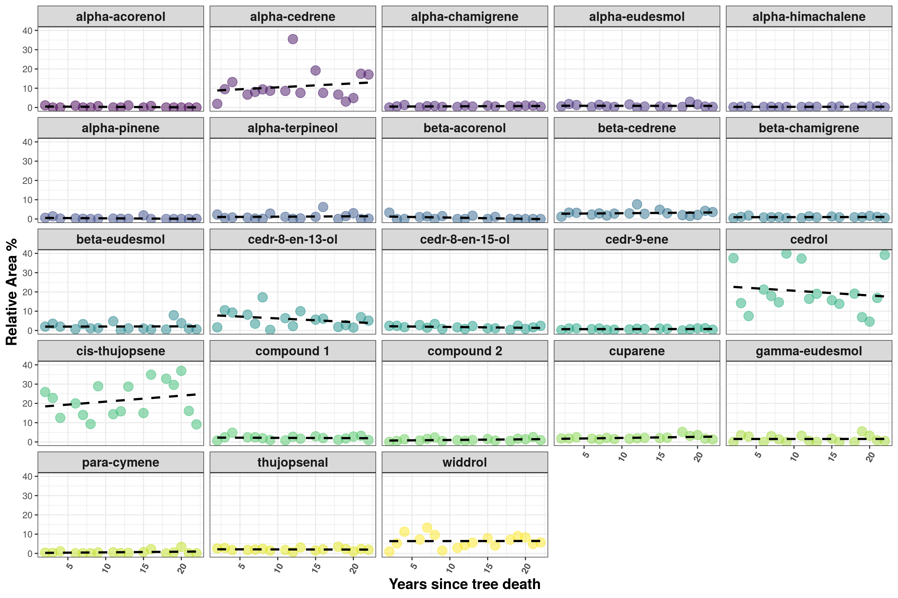
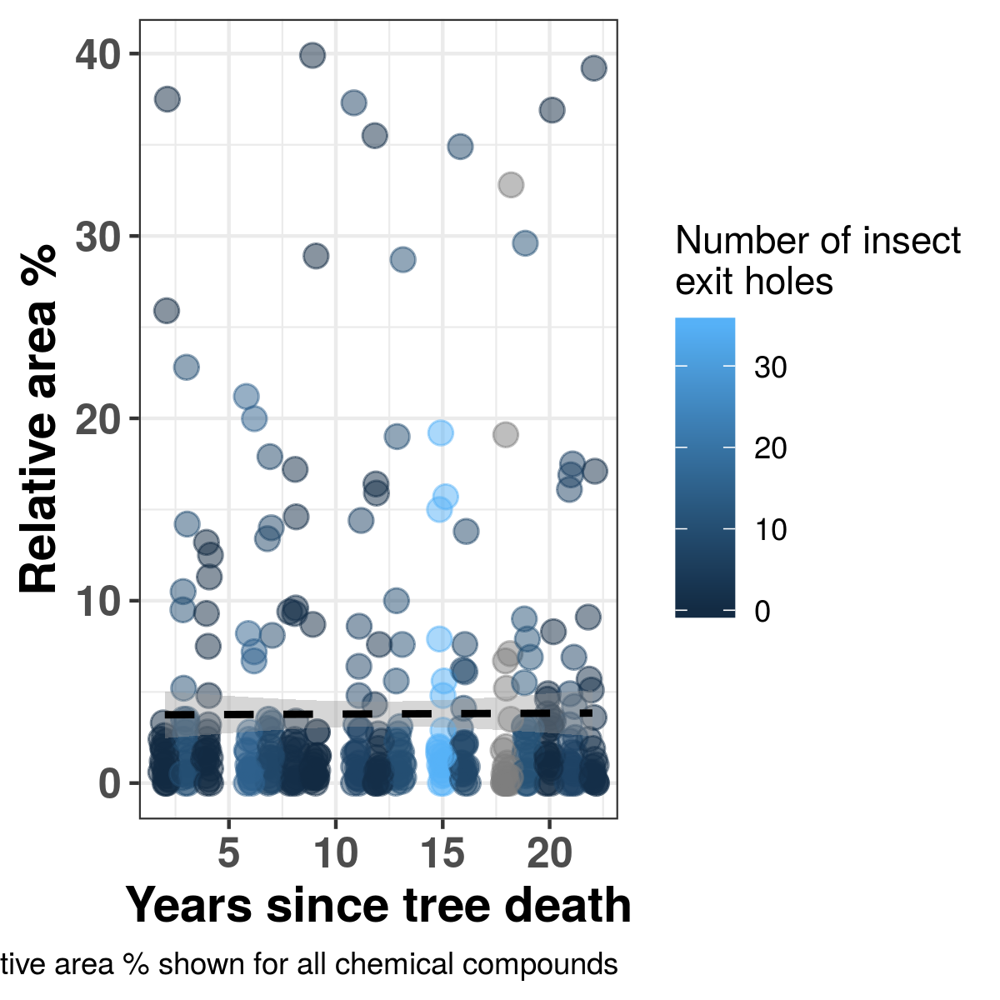
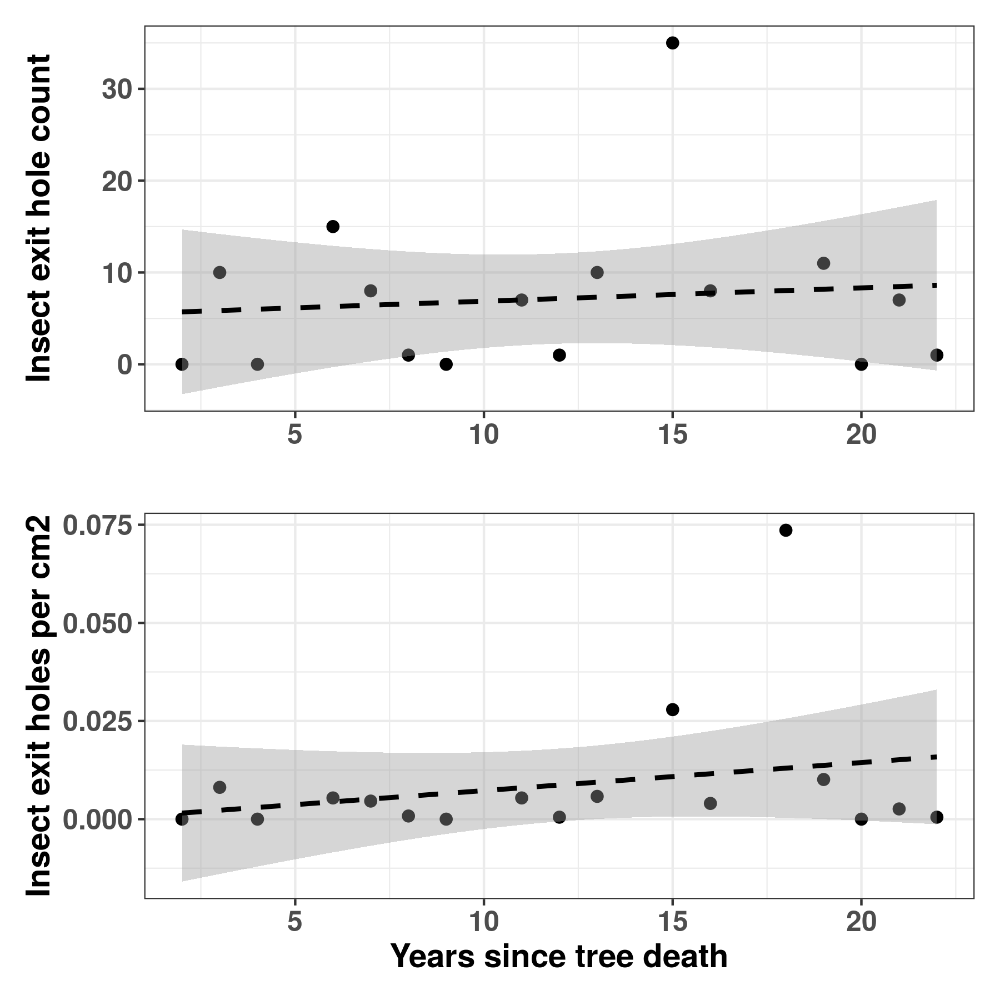

```{r setup, include=FALSE}
knitr::opts_chunk$set(echo = TRUE)
library(tidyverse)
library(skimr)
library(plotly)
```


```{r,include=FALSE}
# load data
meta <- read.csv("../metadata/cleaned_metadata.csv")
```


## Quick glimpse of chemical and entomological data from the dead juniper logs.

Here are the variables we have to work with:
```{r echo=FALSE}

names(meta)

```

There were a total of 17 tree samples taken. 

____


## Here's a plot showing chemical compounds over time: 
```{r, out.width = "500px",echo=FALSE}

```

## Here's the same plot, but not split by compound, showing average VOC over time
```{r, out.width = "500px",echo=FALSE}

```


## This shows percent yield (w/w) against time (years since area burned)
```{r, out.width = "500px",echo=FALSE}
knitr::include_graphics("../output/figs/Fig3_Yield_over_Time.png")
```


## Here's the insect activity plotted against time since burn:
```{r, out.width = "500px",echo=FALSE}

```


# None of these observations are significantly affected by time.

## Here's the stats table:

```{r,echo=FALSE}
readLines("../output/stats/glm_compounds_over_time.txt")
```